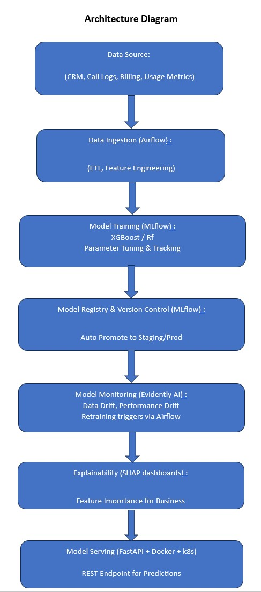

# Telecom Customer Retention System

An end-to-end **MLOps pipeline** that predicts customer churn for a telecom provider.  
The project integrates **MLflow**, **Airflow**, and **Kubeflow Pipelines** for automated training, tracking, and deployment.

## 🚀 Features
- Automated churn prediction pipeline using **XGBoost** and **RandomForest**
- **Airflow DAG** for model retraining and data ingestion
- **MLflow** for experiment tracking and model registry
- **Evidently AI** for data & model drift monitoring
- **SHAP** dashboards for explainability
- **Kubeflow Pipeline** for scalable training workflows
- Deployed as a microservice (**FastAPI**) with Kubernetes manifests

## 📊 Architecture

## 🧩 Tech Stack
Python, MLflow, Airflow, Kubeflow, XGBoost, SHAP, EvidentlyAI, Docker, Kubernetes

## 🧠 Results
- Improved retention strategy with estimated **$2M cost savings**
- Automated drift detection and retraining improved SLA by 40%

## 🧰 Folder Structure
